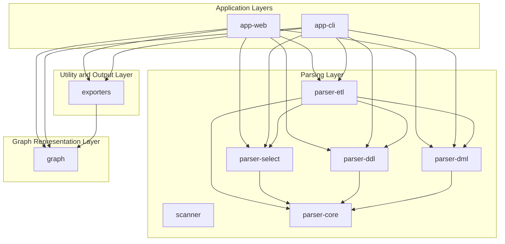

# Project Architecture

The TDT SQL Scan project is designed with a modular and layered architecture to facilitate robust SQL analysis, maintainability, and extensibility. Its primary goal is to parse various SQL dialects, particularly Teradata BTEQ scripts, to build a comprehensive understanding of data flow and dependencies, which can then be visualized or exported.

## Modular Design Principles

The project is structured into several independent Maven modules. This modularity promotes:

*   **Separation of Concerns:** Each module focuses on a specific set of functionalities, reducing complexity.
*   **Reusability:** Core parsing and graph components can be reused across different applications (CLI, Web).
*   **Maintainability:** Changes in one module are less likely to impact others, simplifying development and debugging.
*   **Scalability:** Individual components can be developed and tested in isolation.

## Core Components and Layers

The architecture can be broadly categorized into the following logical layers:

### 1. Parsing Layer

This layer is responsible for the lexical analysis and syntactic parsing of SQL and BTEQ scripts. It transforms raw script text into structured, in-memory representations.

*   **`scanner`**: Acts as the lexical analyzer, breaking down the input script into a stream of tokens. While not explicitly detailed in the initial structure, it's a fundamental component for any parser.
*   **`parser-core`**: Provides the foundational elements for all parsers, including common SQL constructs, utility functions, and potentially the base Abstract Syntax Tree (AST) nodes.
*   **`parser-select`**: Specializes in parsing `SELECT` statements, extracting clauses like `FROM`, `WHERE`, `GROUP BY`, `ORDER BY`, and identifying tables, columns, and joins.
*   **`parser-ddl`**: Handles Data Definition Language (DDL) statements such as `CREATE TABLE`, `DROP TABLE`, `CREATE INDEX`, capturing schema modifications.
*   **`parser-dml`**: Focuses on Data Manipulation Language (DML) statements like `INSERT`, `UPDATE`, and `DELETE`, identifying affected tables and data operations.
*   **`parser-etl`**: Specifically designed to parse ETL scripts, particularly Teradata BTEQ. It understands BTEQ commands, control flow, and extracts embedded SQL statements for further analysis by other parsers.

### 2. Graph Representation Layer

Once the SQL scripts are parsed, their inherent relationships and data flow are modeled using graph data structures.

*   **`graph`**: This module defines the core graph data structures (`Node`, `Edge`, `Graph`) used to represent the dependencies and data lineage extracted from the SQL scripts. Nodes typically represent tables, columns, or processes, while edges represent data flow or relationships.

### 3. Application Layers

These layers provide the user interfaces for interacting with the core parsing and graph functionalities.

*   **`app-cli`**: The Command-Line Interface application. It allows users to execute analysis tasks programmatically, making it suitable for batch processing, scripting, and integration into automated workflows.
*   **`app-web`**: The Web Application. It offers a graphical user interface for interactive analysis, allowing users to upload scripts, visualize generated graphs, and explore results through a web browser.

### 4. Utility and Output Layer

This layer handles the generation of various output formats from the analyzed data.

*   **`exporters`**: Responsible for converting the in-memory graph representations and analysis results into different output formats, such as JSON, XML, or potentially image formats for graph visualization.

## Component Diagram

## Data Flow Overview

A typical data flow within the TDT SQL Scan system would involve:

1.  **Input:** A user provides an SQL or BTEQ script via the `app-cli` or `app-web`.
2.  **Scanning & Parsing:** The script is fed through the `scanner` and then processed by the relevant parsers (`parser-etl`, `parser-select`, `parser-ddl`, `parser-dml`).
3.  **Graph Construction:** The parsed information is used to build and populate a `Graph` structure, capturing relationships and data movements.
4.  **Analysis & Output:** The constructed graph can then be analyzed by the application layers, or transformed into various output formats by the `exporters` module for reporting or further processing.

## Key Technologies

*   **Java 8:** The primary programming language, chosen for its robustness, ecosystem, and performance.
*   **Apache Maven:** Used for project management, dependency management, and the build lifecycle, enforcing the modular structure.
*   **Spring Boot:** Utilized by the `app-web` module to rapidly develop and deploy the web application, leveraging its convention-over-configuration approach.

## Manejo de Errores y Resiliencia

La aplicación TDT SQL Scan implementa una estrategia robusta para el manejo de errores, centrándose en la claridad, la recuperación y la resiliencia en sus diferentes capas. El objetivo es proporcionar retroalimentación útil al usuario y mantener la estabilidad del sistema incluso frente a entradas inesperadas o fallos internos.

### Excepciones Específicas

*   **`SQLParseException`**: Esta es la excepción central para errores relacionados con el parsing de sentencias SQL o BTEQ. Se lanza cuando el formato de la consulta es inválido, faltan componentes esperados o la sintaxis no es reconocida por los parsers específicos. Contiene mensajes descriptivos que ayudan a identificar la causa raíz del problema en la sentencia SQL.

### Estrategias Generales de Manejo de Errores:

1.  **Validación de Entrada**: Antes de intentar el parsing, especialmente en la capa web (`app-web`), se realiza una validación básica de los ficheros subidos para asegurar que son del tipo esperado y no están vacíos. Esto previene errores de parsing innecesarios.
2.  **Captura y Propagación Controlada**: Las excepciones de parsing (`SQLParseException`) y otras excepciones de tiempo de ejecución son capturadas en los puntos de entrada de los módulos (ej. `BteqUploadController` en `app-web`). En lugar de simplemente dejar que la aplicación falle, se registran los errores detalladamente y se transforman en respuestas amigables para el usuario (ej. mensajes de error en la UI o códigos de error en la CLI).
3.  **Logging Detallado**: Se utiliza un sistema de logging (`slf4j` con `Logback` o similar) en todas las capas para registrar eventos importantes, advertencias y errores. Los mensajes de error incluyen stack traces completos en entornos de desarrollo para facilitar la depuración, pero se resumen en producción para evitar exponer detalles internos sensibles.
4.  **Respuestas al Usuario**: En la aplicación web, los errores de parsing o de procesamiento se comunican al usuario a través de mensajes en la interfaz, indicando qué script o qué parte de la consulta causó el problema. En la CLI, se devuelven códigos de salida no cero y mensajes de error claros.
5.  **Resiliencia en el Procesamiento de Múltiples Scripts**: Cuando se procesan múltiples scripts (ej. en `app-web` al subir varios ficheros), la aplicación está diseñada para manejar errores en scripts individuales sin detener el procesamiento de los demás. Los resultados de los scripts fallidos se reportan como errores, mientras que los exitosos se procesan normalmente.

### Consideraciones de Resiliencia

*   **Aislamiento de Fallos**: La modularidad del proyecto ayuda a contener los fallos. Un error en un `parser-select` no debería afectar la capacidad del `parser-ddl` para funcionar, por ejemplo.
*   **Manejo de Recursos**: Se asegura que los recursos (ej. streams de ficheros) se cierren correctamente incluso si ocurren excepciones, utilizando bloques `try-with-resources`.

En resumen, el manejo de errores se enfoca en la detección temprana, la información detallada para la depuración, la comunicación clara al usuario y la capacidad de la aplicación para continuar operando a pesar de fallos localizados.

## Aspectos de Seguridad

La seguridad es un pilar fundamental en el diseño de la aplicación `app-web`, especialmente en lo que respecta a la autenticación y autorización de usuarios. Se ha implementado Spring Security para proporcionar un marco de seguridad robusto y configurable.

### Implementación de Spring Security

La configuración de seguridad principal se encuentra en la clase `com.tdtsqlscan.web.config.SecurityConfig.java`. Esta clase define:

*   **Autenticación**: Se utiliza un `DaoAuthenticationProvider` que se integra con un `UserDetailsService` personalizado (`UserDetailsServiceImpl`) para cargar los detalles del usuario desde la base de datos. Las contraseñas se codifican utilizando `BCryptPasswordEncoder`, un algoritmo de hash de contraseñas fuerte y recomendado.

*   **Autorización Basada en Roles**: La aplicación implementa un control de acceso basado en roles (`RBAC`) con los siguientes roles principales:
    *   `ROLE_ADMIN`: Usuarios con privilegios administrativos, con acceso a secciones como `/admin/**`.
    *   `ROLE_USER`: Usuarios estándar con acceso a las funcionalidades principales de la aplicación, como `/app/**`.

    Las reglas de autorización se configuran para proteger las rutas de la siguiente manera:
    *   `/login`, `/register`, `/forgot-password`, `/reset-password`, `/email-verification`, y los recursos estáticos (`/css/**`, `/js/**`, `/images/**`) son accesibles públicamente.
    *   `/app/**` requiere el rol `ROLE_USER` o `ROLE_ADMIN`.
    *   `/admin/**` requiere el rol `ROLE_ADMIN`.
    *   Cualquier otra solicitud autenticada requiere el rol `ROLE_USER`.

*   **Protección CSRF (Cross-Site Request Forgery)**: Spring Security proporciona protección CSRF por defecto. Sin embargo, para facilitar el desarrollo y el acceso a la consola H2 en entornos de desarrollo, la protección CSRF está deshabilitada para la ruta `/h2-console/**`. En un entorno de producción, esta configuración debe ser revisada y ajustada según las políticas de seguridad.

*   **Gestión de Sesiones**: La aplicación gestiona las sesiones de usuario, incluyendo la invalidación de sesiones al cerrar sesión y la prevención de fijación de sesiones.

*   **Manejo de Éxito de Autenticación**: La clase `com.tdtsqlscan.web.config.CustomAuthenticationSuccessHandler.java` personaliza el comportamiento después de una autenticación exitosa. Verifica si un usuario necesita cambiar su contraseña (ej. primer inicio de sesión o contraseña temporal) y lo redirige a la página de cambio de contraseña; de lo contrario, procede a la URL de destino predeterminada.

### Otras Consideraciones de Seguridad

*   **Validación de Entrada**: Además de la seguridad a nivel de autenticación/autorización, se implementan prácticas de validación de entrada para prevenir vulnerabilidades comunes como la inyección SQL (a través del uso de sentencias preparadas en las interacciones con la base de datos) y XSS (Cross-Site Scripting) en la capa de presentación (Thymeleaf realiza un escape automático por defecto).
*   **Cabeceras de Seguridad**: Se configuran cabeceras HTTP de seguridad (ej. `X-Frame-Options` para prevenir clickjacking) para mejorar la postura de seguridad de la aplicación web.
*   **Gestión de Secretos**: Las credenciales de bases de datos y otros secretos se gestionan a través de ficheros de propiedades (`application.properties`, `application-production.properties`) y se recomienda el uso de variables de entorno o sistemas de gestión de secretos en producción para evitar su exposición directa en el código fuente.

## Estrategia de Pruebas

La calidad y fiabilidad del proyecto TDT SQL Scan se aseguran mediante una estrategia de pruebas que se centra principalmente en pruebas unitarias, complementadas con pruebas de integración cuando es necesario. El objetivo es verificar la correcta funcionalidad de cada componente de forma aislada y la interacción entre ellos.

### Pruebas Unitarias con JUnit

*   **Enfoque**: La mayoría de las pruebas en el proyecto son pruebas unitarias, escritas utilizando el framework JUnit 5 (o JUnit 4 en módulos más antiguos). Estas pruebas se centran en verificar la lógica de negocio de clases individuales, métodos y funciones, asegurando que cada unidad de código se comporta como se espera.

*   **Cobertura**: Se busca una alta cobertura de código en los módulos de parsing (`parser-core`, `parser-select`, `parser-ddl`, `parser-dml`, `parser-etl`) y en el módulo `graph`, ya que son el corazón de la lógica de análisis de SQL. Esto se logra probando diferentes escenarios de entrada (SQL válidos, inválidos, casos borde) para cada parser.

*   **Mocks y Stubs**: Para aislar las unidades de código bajo prueba, se utilizan mocks y stubs cuando una clase tiene dependencias externas. Esto permite probar la lógica interna sin depender de la disponibilidad o el estado de otros componentes.

*   **Ejemplos de Pruebas**: Cada `QueryParser` (ej. `SelectParser`, `CreateTableParser`) tiene su correspondiente clase de prueba (ej. `SelectParserTest`, `CreateTableParserTest`) que verifica:
    *   Que el método `supports()` identifica correctamente las sentencias SQL que puede parsear.
    *   Que el método `parse()` genera el `SQLQuery` (AST) correcto para diversas entradas SQL.
    *   Que se lanzan `SQLParseException` para sentencias SQL mal formadas o no soportadas.

### Pruebas de Integración

*   **Propósito**: Aunque menos frecuentes que las unitarias, se realizan pruebas de integración para verificar la interacción entre módulos clave, como la forma en que `parser-etl` utiliza los `QueryParser` de otros módulos para procesar un script BTEQ completo, o cómo `app-web` interactúa con los servicios de parsing y los convertidores de grafos.

*   **Base de Datos en Memoria**: Para las pruebas de integración que involucran la capa de persistencia en `app-web`, se utiliza una base de datos en memoria (como H2) para asegurar que las pruebas sean rápidas, reproducibles y no dependan de una base de datos externa.

### Herramientas y Automatización

*   **Maven Surefire Plugin**: Las pruebas se ejecutan automáticamente como parte del ciclo de vida de Maven (`mvn test`) utilizando el Maven Surefire Plugin.
*   **Maven Failsafe Plugin**: Para pruebas de integración, se puede configurar el Maven Failsafe Plugin.
*   **Integración Continua**: Las pruebas se ejecutan en cada push al repositorio de código a través de un pipeline de CI/CD (ej. GitHub Actions) para asegurar que cualquier cambio no introduzca regresiones y que la base de código se mantenga estable.

En resumen, la estrategia de pruebas del proyecto se enfoca en la automatización, la granularidad (pruebas unitarias) y la verificación de las interacciones críticas (pruebas de integración) para garantizar la robustez y corrección del análisis de SQL.
