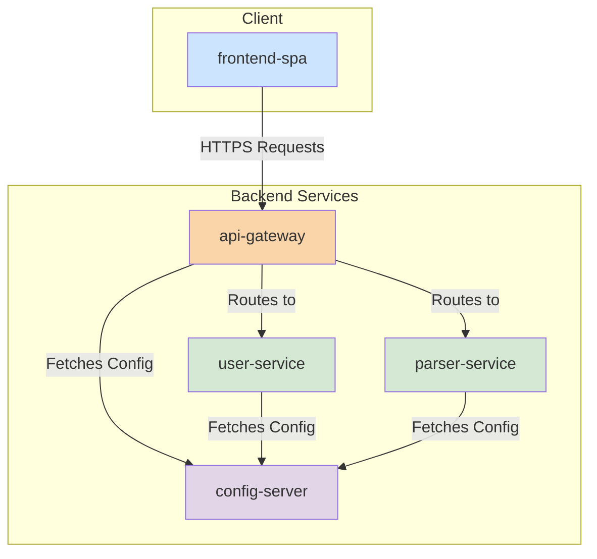

# Project Architecture

The TDT SQL Scan project has transitioned to a modern, microservices-based architecture to enhance scalability, maintainability, and deployment flexibility. This design separates backend functionalities into independent services, fronted by a dedicated Single Page Application (SPA).

## Architectural Principles

The architecture is guided by the following principles:

*   **Decentralization:** Functionality is decomposed into fine-grained, independent services.
*   **Resilience:** The failure of one service should not cascade and bring down the entire system.
*   **Scalability:** Each service can be scaled independently based on its specific load.
*   **Maintainability:** Smaller, focused services are easier to understand, develop, and test.

## System Components

The ecosystem is composed of the following key components:

### 1. `frontend-spa` (Single Page Application)

The primary user interface for the TDT SQL Scan tool. It is a modern web application built with React.

*   **Responsibilities:**
    *   Provides all user-facing features, including script uploading, analysis initiation, and results visualization.
    *   Authenticates users against the `user-service`.
    *   Interacts with backend services exclusively through the `api-gateway`.
*   **Technology:** React, Vite, TypeScript.

### 2. `api-gateway`

This service acts as the single entry point for all incoming client requests from the `frontend-spa`.

*   **Responsibilities:**
    *   **Request Routing:** Routes requests to the appropriate downstream microservice (e.g., `parser-service`, `user-service`).
    *   **Authentication:** Works with the `user-service` to secure endpoints and verify JWTs.
    *   **Cross-Cutting Concerns:** Can handle concerns like rate limiting, logging, and SSL termination.
*   **Technology:** Spring Cloud Gateway.

### 3. `user-service`

This microservice is responsible for all user management and authentication tasks.

*   **Responsibilities:**
    *   User registration and login.
    *   JWT (JSON Web Token) generation and validation.
    *   User profile management.
*   **Technology:** Spring Boot, Spring Security, Spring Data JPA.

### 4. `parser-service`

The core analysis engine of the application, dedicated to parsing and analyzing SQL scripts.

*   **Responsibilities:**
    *   Accepts raw SQL or BTEQ script content.
    *   Parses the script to identify statements, dependencies, and data flow.
    *   Returns structured analysis results (e.g., in JSON format).
*   **Technology:** Spring Boot, ANTLR.

### 5. `config-server`

A centralized configuration service for all other microservices in the ecosystem.

*   **Responsibilities:**
    *   Provides a central place to manage configuration properties for all services.
    *   Ensures that services have consistent configuration without hardcoding properties.
*   **Technology:** Spring Cloud Config Server.

## Component Diagram

## Data Flow Overview

A typical user interaction follows this flow:

1.  **User Action:** A user interacts with the `frontend-spa` in their browser (e.g., logs in or uploads a script).
2.  **API Request:** The `frontend-spa` sends an HTTPS request to the `api-gateway`. The request includes a JWT for authenticated actions.
3.  **Routing and Auth:** The `api-gateway` validates the JWT (if present) and routes the request to the correct microservice.
    *   Login/register requests go to the `user-service`.
    *   Script analysis requests go to the `parser-service`.
4.  **Service Processing:** The target microservice processes the request. For example, the `parser-service` analyzes the script and generates a result.
5.  **Response:** The microservice returns a response to the `api-gateway`, which then forwards it back to the `frontend-spa`.
6.  **UI Update:** The `frontend-spa` receives the data and updates the UI to display the results to the user.

## Key Technologies

*   **Backend:** Java 17, Spring Boot 3, Spring Cloud
*   **Frontend:** React, Vite, TypeScript, Node.js
*   **Parsing:** ANTLR
*   **Build & CI/CD:** Apache Maven, Docker
*   **Configuration:** Git (for `config-server` backend)
