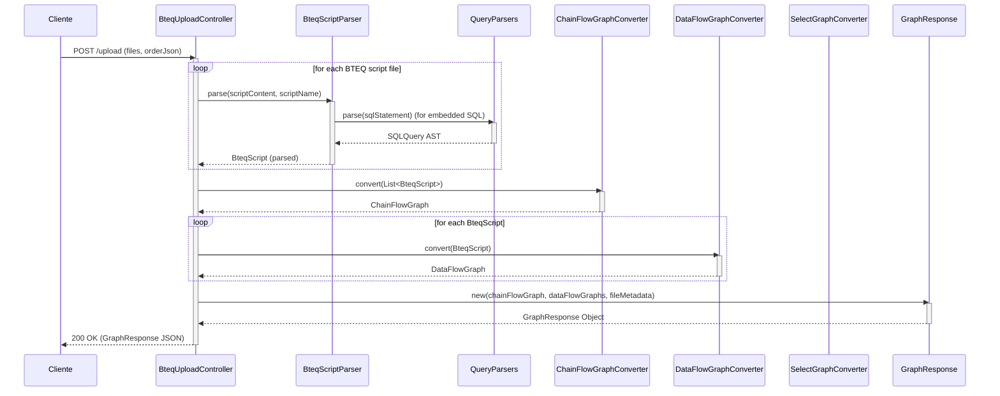

# app-web Module Documentation

## Purpose

The `app-web` module provides the web-based graphical user interface (GUI) for the TDT SQL Scan project. It allows users to interactively upload BTEQ scripts, visualize their data flow and control flow, and analyze SQL statements through a web browser. Built with Spring Boot, it serves as the primary interactive application layer, leveraging the core parsing and graph generation capabilities of other modules.

## Key Components

### Main Application Class

*   **`Application.java`**
    *   **Description:** The entry point for the Spring Boot web application. It initializes and runs the entire web context.

### REST Controllers

*   **`BteqUploadController`**
    *   **Description:** A `@RestController` that handles file uploads and visualization requests related to BTEQ scripts.
    *   **Endpoints:**
        *   `POST /upload`: Accepts an array of BTEQ script files and a JSON string specifying their order. It parses the scripts, generates a chain flow graph (inter-script dependencies), individual BTEQ data flow graphs, and extracts file metadata. Returns a `GraphResponse` object containing these graphs and metadata.
        *   `GET /hello`: A simple endpoint returning "Hello from BTEQ Flow Visualizer!".
        *   `POST /api/visualize-select`: Takes a script name and command ID, extracts the relevant `SELECT` query (or sub-query from `INSERT` or `CREATE TABLE AS SELECT`), and converts it into a `Graph` using `SelectGraphConverter` for detailed visualization.
    *   **Dependencies:** Utilizes `BteqScriptParser` (from `parser-etl`) for script parsing, `ChainFlowGraphConverter`, `DataFlowGraphConverter`, `SelectGraphConverter`, and `ObjectMapper` for JSON processing.

### Diagrama de Secuencia: Flujo de `POST /upload`



*   **`controller/AdminController.java` (and others)**
    *   **Description:** (Based on naming convention) These classes likely handle administrative functionalities, such as user management, FAQ content management, and "What's New" updates, providing endpoints for the `/admin` section of the application.

*   **`controller/BlogController.java`**
    *   **Description:** (Based on naming convention) This class likely handles endpoints related to a blog section, displaying posts and managing blog content.

### Graph Converters

These classes are responsible for transforming parsed SQL and BTEQ structures into the generic `Graph` representation defined in the `graph` module.

*   **`BteqScriptGraphConverter`**
    *   **Description:** Converts a single `BteqScript` object into a `Graph` that visually represents the sequence of BTEQ commands (both control and SQL). It creates nodes for each command and edges for the sequential flow, adding properties for visual styling and metadata.

*   **`ChainFlowGraphConverter`**
    *   **Description:** Converts a list of `BteqScript` objects into a `Graph` that illustrates the overall execution chain or dependency flow between multiple BTEQ scripts. It positions script nodes based on a provided order and adds visual connectors (arrow nodes) between them.

*   **`DataFlowGraphConverter`**
    *   **Description:** Converts a single `BteqScript` into a `Graph` focusing on the data flow within that script. It creates nodes for BTEQ commands and relevant tables, arranging them in horizontal "lanes" based on the tables they interact with. It also extracts and embeds metadata from SQL queries into the command nodes.

*   **`SelectGraphConverter`**
    *   **Description:** Converts a `SelectQuery` object (from `parser-select`) into a simplified `Graph`. This graph typically shows source tables, a central "SELECT Process" node, and a "Result Set" node, with edges indicating data flow.

### Data Models and Utilities

*   **`FileMetadata.java`**
    *   **Description:** A simple Plain Old Java Object (POJO) used to store summary information about a parsed BTEQ script file, including the number of transactions, identified input tables, and output tables.

*   **`domain/` (Package)**
    *   **Description:** This package likely contains JPA entities or domain models (e.g., `User`, `Role`, `BlogPost`, `FAQ`) that represent the core business objects of the application.

*   **`dto/` (Package)**
    *   **Description:** This package likely contains Data Transfer Objects (DTOs) used for transferring data between the client and server, or between different layers of the application, often tailored for specific API endpoints or views.

### Configuration

*   **`config/CustomAuthenticationSuccessHandler.java`**
    *   **Description:** A Spring Security handler that customizes the behavior after a user successfully authenticates. It checks if a user needs to change their password and redirects them accordingly; otherwise, it proceeds to the default target URL.

*   **`config/SecurityConfig.java`**
    *   **Description:** The central Spring Security configuration for the web application. It defines:
        *   **Authentication:** Configures `DaoAuthenticationProvider` using `UserDetailsServiceImpl` and `BCryptPasswordEncoder` for password hashing.
        *   **Authorization:** Specifies access rules for different URL patterns (e.g., `/login`, `/register`, static resources are public; `/app/**` requires `ROLE_USER` or `ROLE_ADMIN`; `/admin/**` requires `ROLE_ADMIN`).
        *   **Login/Logout:** Configures the custom login page (`/login`) and logout success URL.
        *   **CSRF:** Disables CSRF protection for `/h2-console/**` (common for development databases).
        *   **Headers:** Configures frame options for security.

### Services

*   **`service/UserDetailsServiceImpl.java` (and others)**
    *   **Description:** (Based on naming convention) This package likely contains service classes that encapsulate business logic. `UserDetailsServiceImpl` is a crucial component for Spring Security, responsible for loading user-specific data during authentication.

### Repositories

*   **`repository/UserRepository.java` (and others)**
    *   **Description:** (Based on naming convention) This package likely contains Spring Data JPA repositories, providing interfaces for data access operations (CRUD) on domain entities.

### Startup

*   **`startup/` (Package)**
    *   **Description:** This package might contain classes that execute specific tasks or initialize data when the application starts up (e.g., populating initial user data, performing database migrations).

## Functionality

The `app-web` module provides:

*   A web interface for uploading and managing BTEQ script files.
*   Visualization of the sequential flow between multiple BTEQ scripts (chain flow).
*   Detailed data flow visualization within individual BTEQ scripts, showing interactions with tables.
*   Specific visualization for `SELECT` queries, highlighting source tables and result sets.
*   Extraction and display of metadata for uploaded files (transactions, input/output tables).
*   User authentication and authorization with role-based access control.
*   Support for user registration, login, and password management (including forced password changes).
*   (Implicitly, via controllers) Functionalities for managing blog posts, FAQs, and other administrative content.

## Dependencies

This module has significant dependencies on:

*   **Spring Boot & Spring Framework:** For web application development, REST APIs, dependency injection, and security.
*   **`parser-core`, `parser-select`, `parser-ddl`, `parser-dml`, `parser-etl`:** For parsing SQL and BTEQ scripts.
*   **`graph`:** For the core graph data structures (`Node`, `Edge`, `Graph`).
*   **`com.fasterxml.jackson.databind.ObjectMapper`:** For JSON serialization/deserialization.
*   **`org.slf4j.Logger`:** For logging.

## How to Run

To run the `app-web` application, you would typically build the project and then execute the generated JAR file:

1.  **Build the project (from the root directory):**
    ```bash
    mvn clean install -DskipTests
    ```
2.  **Navigate to the `app-web` target directory:**
    ```bash
    cd app-web/target
    ```
3.  **Run the JAR file:**
    ```bash
    java -jar app-web-<version>.jar
    ```
    (Replace `<version>` with the actual version number, e.g., `app-web-0.0.1-SNAPSHOT.jar`)

The application will typically start on port 8080, accessible via `http://localhost:8080` in a web browser.

## Tecnologías Frontend

La interfaz de usuario web de `app-web` se construye utilizando una combinación de tecnologías de renderizado del lado del servidor y bibliotecas de cliente:

*   **Thymeleaf:** Utilizado como motor de plantillas para renderizar las vistas HTML en el lado del servidor, permitiendo la integración fluida de datos del backend en el frontend.
*   **HTML5, CSS3, JavaScript:** Las tecnologías web estándar para la estructura, el estilo y la interactividad del lado del cliente.
*   **Bootstrap:** Un framework CSS popular para el diseño responsivo y la creación rápida de interfaces de usuario modernas y atractivas.
*   **Bibliotecas JavaScript Adicionales:** Para funcionalidades específicas como la visualización de gráficos (ej. D3.js, vis.js) o efectos visuales (ej. particles.js).

## Arquitectura Frontend

La interfaz de usuario web de `app-web` se construye utilizando una combinación de tecnologías de renderizado del lado del servidor y bibliotecas de cliente para ofrecer una experiencia interactiva y dinámica.

### Thymeleaf para el Renderizado del Lado del Servidor

*   **Motor de Plantillas**: Thymeleaf es el motor de plantillas principal utilizado para generar las vistas HTML en el lado del servidor. Permite la integración fluida de datos del backend en el frontend, facilitando la creación de páginas dinámicas y la gestión de la lógica de presentación directamente en el servidor.
*   **Ventajas**: Proporciona una sintaxis natural que se puede previsualizar directamente en navegadores estáticos, mejora la seguridad al prevenir XSS por defecto y se integra perfectamente con Spring Framework.

### Visualización de Grafos con `vis-network.js`

*   **Librería de Visualización**: La librería JavaScript `vis-network.js` (parte de la suite `vis.js`) es la herramienta central para la visualización interactiva de grafos en el frontend. Esta librería es capaz de renderizar redes complejas de nodos y aristas, permitiendo a los usuarios explorar las relaciones de flujo de datos y control de manera intuitiva.
*   **Funcionalidades Clave**: `vis-network.js` ofrece:
    *   **Renderizado Dinámico**: Creación y actualización de grafos en tiempo real.
    *   **Interactividad**: Zoom, paneo, arrastre de nodos, selección de elementos y eventos de clic.
    *   **Personalización**: Amplias opciones para estilizar nodos, aristas y el diseño general del grafo.
    *   **Diseños Automáticos**: Algoritmos de diseño de grafos para organizar visualmente los nodos y aristas de manera legible.

### Lógica Principal en `app.html`

El archivo `app.html` es la plantilla principal que orquesta la interacción del usuario con la aplicación. Su lógica JavaScript se encarga de:

1.  **Gestión de Subida de Ficheros**: Maneja el formulario de subida de ficheros, enviando las solicitudes POST al endpoint `/upload` del `BteqUploadController`. Recopila los ficheros seleccionados y el orden de ejecución especificado por el usuario.
2.  **Interacción con los Grafos**: Una vez que el backend devuelve una `GraphResponse` (que contiene los grafos de flujo de cadena y flujo de datos), el JavaScript en `app.html` utiliza `vis-network.js` para:
    *   **Renderizar el Grafo de Flujo de Cadena**: Muestra la secuencia de ejecución de los scripts BTEQ.
    *   **Renderizar los Grafos de Flujo de Datos**: Permite al usuario seleccionar un script BTEQ individual para visualizar su grafo de flujo de datos detallado.
    *   **Manejo de Eventos de Clic**: Detecta clics en nodos del grafo para, por ejemplo, mostrar información detallada del nodo o activar la visualización de un sub-grafo (como el grafo de `SELECT` para una consulta específica).
3.  **Actualización de la Barra de Metadatos**: Extrae y muestra la información de `FileMetadata` (número de transacciones, tablas de entrada/salida) en una barra lateral o sección dedicada, proporcionando un resumen rápido del script analizado.
4.  **Visualización de Consultas SELECT**: Cuando el usuario interactúa con un nodo que representa una consulta `SELECT`, el JavaScript realiza una llamada AJAX al endpoint `/api/visualize-select` para obtener el grafo específico de esa consulta y lo renderiza en un área dedicada.

En resumen, `app.html` actúa como el orquestador del lado del cliente, conectando la entrada del usuario, la visualización de datos y la interacción con los resultados del análisis de SQL y BTEQ proporcionados por el backend.
